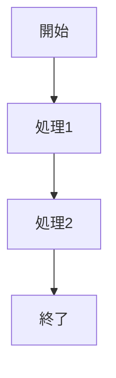
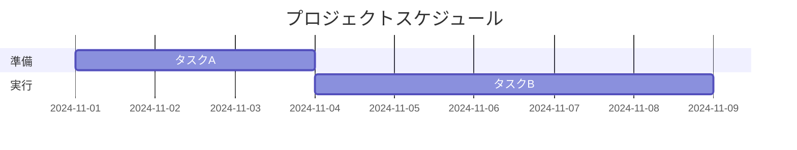

GitHubを効果的に使うための基本的なマニュアルを以下にまとめました。
これには、GitHubのアカウント作成からリポジトリの管理、プルリクエストの作成方法までをカバーしています。

```mermaid
graph TD
    A[GitHubの使い方]

    %% アカウント作成
    A1[アカウント作成]
    A --> A1
    A1 --> B1[GitHubにサインアップ]
    A1 --> B2[メール認証]

    %% リポジトリ作成
    A2[リポジトリ作成]
    A --> A2
    A2 --> C1[リポジトリ名入力]
    A2 --> C2[リポジトリ設定（パブリック/プライベート）]
    A2 --> C3[README.md作成]

    %% ローカルリポジトリの設定
    A3[ローカルリポジトリの設定]
    A --> A3
    A3 --> D1[Gitインストール]
    A3 --> D2[ローカルリポジトリ初期化]
    A3 --> D3[リモートリポジトリをリンク]

    %% コードの追加とコミット
    A4[コードの追加とコミット]
    A --> A4
    A4 --> E1[ファイル編集]
    A4 --> E2[変更をステージング]
    A4 --> E3[コミット]
    A4 --> E4[プッシュ]

    %% プルリクエストの作成
    A5[プルリクエストの作成]
    A --> A5
    A5 --> F1[フォーク]
    A5 --> F2[クローン]
    A5 --> F3[ブランチ作成]
    A5 --> F4[変更をプッシュ]
    A5 --> F5[プルリクエスト作成]

    %% ブランチ操作
    A6[ブランチ操作]
    A --> A6
    A6 --> G1[新しいブランチ作成]
    A6 --> G2[ブランチをプッシュ]
    A6 --> G3[ブランチをマージ]

    %% イシュートラッキング
    A7[イシュートラッキング]
    A --> A7
    A7 --> H1[新しいIssue作成]
    A7 --> H2[コメント追加]

    %% リポジトリ管理
    A8[リポジトリ管理]
    A --> A8
    A8 --> I1[README.md更新]
    A8 --> I2[ライセンス追加]
    A8 --> I3[Wiki設定]

    %% GitHub Actions（CI/CD）
    A9[GitHub Actions（CI/CD）]
    A --> A9
    A9 --> J1[CI/CDワークフロー設定]

    %% GitHub Pages
    A10[GitHub Pages]
    A --> A10
    A10 --> K1[GitHub Pages設定]
```



---

### 1. **GitHubアカウントの作成**

1. [GitHubの公式サイト](https://github.com/)にアクセスします。
2. 右上の「Sign up」ボタンをクリックします。
3. 必要な情報（ユーザー名、メールアドレス、パスワード）を入力し、「Create an account」をクリックします。
4. メール認証を行い、アカウントを有効にします。

---

### 2. **リポジトリの作成**

1. GitHubにログイン後、トップページから「New」ボタンをクリックします。
2. リポジトリ名を入力し、リポジトリをパブリック（誰でも見れる）かプライベート（特定のユーザーのみ見れる）に設定します。
3. 必要に応じて「README.md」を作成し、リポジトリの初期化を選択します。
4. 「Create repository」ボタンをクリックします。

---

### 3. **ローカルリポジトリの作成と設定**

#### a. Gitのインストール
1. Gitがインストールされていない場合、[Git公式サイト](https://git-scm.com/)からインストールします。

#### b. ローカルリポジトリの作成
1. ターミナル（またはGit Bash）を開きます。
2. 任意のディレクトリに移動し、以下のコマンドを実行してリポジトリを初期化します。
   ```bash
   git init
   ```

#### c. リモートリポジトリのリンク
1. GitHubで作成したリポジトリのURL（例: `https://github.com/username/repository.git`）をコピーします。
2. 以下のコマンドでリモートリポジトリを追加します。
   ```bash
   git remote add origin https://github.com/username/repository.git
   ```

---

### 4. **コードの追加とコミット**

1. ファイルを作成または編集します。
2. 変更をステージに追加します。
   ```bash
   git add .
   ```
3. コミットを作成します。
   ```bash
   git commit -m "コミットメッセージ"
   ```
4. リモートリポジトリにプッシュします。
   ```bash
   git push origin main
   ```

---

### 5. **プルリクエストの作成**

1. 他のユーザーのリポジトリに変更を加えたい場合、まずそのリポジトリをフォークします。
2. フォークしたリポジトリをクローンします。
   ```bash
   git clone https://github.com/username/repository.git
   ```
3. 作業ブランチを作成します。
   ```bash
   git checkout -b new-feature
   ```
4. 変更を加えてコミットします。
5. 変更をリモートリポジトリにプッシュします。
   ```bash
   git push origin new-feature
   ```
6. GitHub上で、元のリポジトリにプルリクエストを作成します。

---

### 6. **ブランチの操作**

#### a. 新しいブランチの作成
```bash
git checkout -b new-branch
```

#### b. ブランチをリモートリポジトリにプッシュ
```bash
git push origin new-branch
```

#### c. ブランチをマージ
1. メインブランチに切り替えます。
   ```bash
   git checkout main
   ```
2. 作業したブランチをマージします。
   ```bash
   git merge new-branch
   ```

---

### 7. **イシュートラッキング**

1. リポジトリページで「Issues」タブを選択します。
2. 新しいIssueを作成し、バグ、改善点、質問などを管理します。
3. コメントを追加して進捗状況を追跡できます。

---

### 8. **リポジトリの管理**

- **READMEの更新**: プロジェクトの説明を`README.md`ファイルに記載することが重要です。
- **ライセンスの追加**: リポジトリに適切なライセンスを付与して、他のユーザーがコードをどのように使用できるかを示します。
- **Wiki**: より詳細なドキュメントが必要な場合は、リポジトリ内でWikiを有効にできます。

---

### 9. **GitHub Actions（CI/CD）**

1. GitHub Actionsを使用すると、コードがリポジトリにプッシュされるたびに自動的にビルド、テスト、デプロイなどの処理を実行できます。
2. リポジトリの「Actions」タブから新しいワークフローを作成できます。

---

### 10. **GitHub Pages**

GitHub Pagesを使って、リポジトリから直接静的ウェブサイトをホスティングできます。

1. リポジトリの「Settings」タブを開き、「Pages」セクションでブランチを選択して公開します。
2. 公開されたウェブサイトへのリンクが表示されます。

---

以下はGitHubのマークダウン記法を逆引き形式でまとめた表です。

### GitHub Markdown 記法 逆引き表

| **目的**                        | **記法例**                               | **表示例**                               |
|---------------------------------|------------------------------------------|------------------------------------------|
| **見出しを作る**                | `# 見出し1` <br> `## 見出し2`            | 見出し1 <br> 見出し2                    |
| **太字にする**                  | `**太字**`                               | **太字**                                 |
| **斜体にする**                  | `*斜体*`                                 | *斜体*                                   |
| **太字と斜体を組み合わせる**    | `***太字斜体***`                         | ***太字斜体***                           |
| **箇条書き**                    | `- アイテム1` <br> `- アイテム2`         | - アイテム1 <br> - アイテム2            |
| **番号付きリスト**              | `1. アイテム1` <br> `2. アイテム2`       | 1. アイテム1 <br> 2. アイテム2          |
| **リンクを作る**                | `[リンク](https://example.com)`          | [リンク](https://example.com)           |
| **画像を挿入する**              | ``               |                 |
| **コードをインラインで表示**    | `` `コード` ``                           | `コード`                                 |
| **コードブロックを作る**        | ```` ```言語名<br>コード<br>``` ````     | (コードブロックが表示されます)          |
| **引用を作る**                  | `> 引用文`                               | > 引用文                                 |
| **チェックリストを作る**        | `- [ ] 未完了` <br> `- [x] 完了`         | - [ ] 未完了 <br> - [x] 完了            |
| **表を作る**                    | `|列1|列2|` <br> `|---|---|` <br> `|値1|値2|` | (表が表示されます)                      |
| **水平線を引く**                | `---`                                    | ---                                      |
| **打ち消し線を引く**            | `~~打ち消し~~`                           | ~~打ち消し~~                             |
| **脚注を作る**                  | `フットノート[^1]` <br> `[^1]: 詳細`      | (脚注が表示されます)                     |

### 表の例
以下の記法を用いて表を作成できます。

#### 記法:
```markdown
| 見出し1 | 見出し2 |
|---------|---------|
| 値1     | 値2     |
```

#### 表示:
| 見出し1 | 見出し2 |
|---------|---------|
| 値1     | 値2     |

---

以下はGitHub特有の機能や拡張機能を使ったMarkdown記法を逆引き形式でまとめた表です。

---

### GitHub 対応記法 逆引き表

| **目的**                          | **記法例**                                           | **表示例**                                |
|-----------------------------------|----------------------------------------------------|-------------------------------------------|
| **チェックリスト (タスクリスト)**  | `- [ ] 未完了` <br> `- [x] 完了`                   | - [ ] 未完了 <br> - [x] 完了             |
| **絵文字を表示する**               | `:smile:`                                          | 😄                                        |
| **ユーザーをメンション**           | `@username`                                       | @username                                 |
| **リポジトリリンクを簡略化**       | `owner/repo`                                       | [owner/repo](https://github.com/owner/repo) |
| **プルリクエストやIssueを参照**    | `#123`                                             | [#123](https://github.com/.../issues/123) |
| **コミットを参照**                 | `@commit-hash`                                    | @commit-hash                              |
| **絵文字リアクションを指定**       | `:+1:`                                            | 👍                                        |
| **コードブロックの言語指定**       | ```` ```javascript`<br>コード<br>``` ````          | JavaScriptのコードブロックが表示されます |
| **HTMLタグを使用**                 | `<details><summary>詳細</summary>内容</details>`   | (詳細ブロックとして折りたたまれます)     |
| **タスク進捗バーを作成**           | `- [x] 完了` <br> `- [ ] 未完了`                  | タスクのリスト進捗を示す                 |
| **相対パスリンク**                 | `[ファイル名](./path/to/file)`                    | (リンクとして表示)                        |
| **行内改行を維持**                 | `スペース2つ`                                      | (改行されます)                            |
| **リアクションを付与**             | IssueやPRに👍, 🎉などのリアクションを追加           | (GitHub UIで適用可能)                    |
| **スラッシュコマンド (コメント内)** | `/assign @username`                                | 特定ユーザーにIssueを割り当て            |
| **コードの行を参照**               | `[リンク](https://github.com/owner/repo/file#L1)` | 特定行にジャンプするリンク                |
| **ドラッグ&ドロップで画像挿入**   | 画像をドラッグ&ドロップ                            | (画像がアップロードされて挿入されます)    |

---

### サンプル拡張記法例

#### チェックリスト
```markdown
- [ ] 未完了タスク
- [x] 完了したタスク
```

**表示例:**
- [ ] 未完了タスク  
- [x] 完了したタスク

---

#### 折りたたみブロック (details)
```markdown
<details>
  <summary>クリックで詳細表示</summary>
  折りたたまれているテキスト
</details>
```

**表示例:**

<details>
  <summary>クリックで詳細表示</summary>
  折りたたまれているテキスト
</details>

---

以下はGitHubのMarpとMermaid記法についての逆引き表です。

---

## Marp 記法 逆引き表
MarpはMarkdownでスライドを作成するための記法を提供します。GitHub上でもサポートされています。

| **目的**                   | **記法例**                                                   | **表示例**                                  |
|----------------------------|------------------------------------------------------------|---------------------------------------------|
| **スライドの分割**         | `---`                                                      | スライドを分割                              |
| **スライドのタイトルを指定**| `# タイトル`                                               | スライドタイトルとして表示                  |
| **スライドのテーマを指定** | `theme: default`                                           | デフォルトテーマが適用される                |
| **背景画像を設定**         | ``                                               | 背景画像が設定される                        |
| **フォントサイズを変更**   | `# タイトル {font-size: 40px}`                             | フォントサイズが40pxになる                  |
| **カスタムスタイルを適用** | `<!-- _style: "text-align: center;" -->`                   | テキストが中央寄せになる                    |
| **リストのスライド表示**   | `- アイテム1` <br> `- アイテム2`                           | リスト形式で表示                            |
| **ノートを追加**           | `<!-- presenter notes -->`                                 | プレゼンターノートとして非表示で記録        |
| **段組み (Grid Layout)**   | `<!-- columns: 2 -->`                                      | 2段組みレイアウトが適用される               |

---

### Marpの基本例

#### 記法:
```markdown
---
theme: gaia
_class: lead
paginate: true
---

# タイトルスライド

---

## リストのスライド

- 項目1
- 項目2
- 項目3

---

<!-- _style: "text-align: center;" -->
# 中央寄せテキスト
```

#### 出力:  
スライドに対応する形式で表示されます。

---

## Mermaid 記法 逆引き表
MermaidはダイアグラムをMarkdownで記述できるツールです。GitHub上で以下の形式を利用できます。

| **目的**               | **記法例**                                                 | **表示例**                                 |
|------------------------|----------------------------------------------------------|--------------------------------------------|
| **フローチャートを作る** | ```mermaid<br>graph TD<br>A-->B<br>B-->C```              | A → B → C のフローチャート                 |
| **シーケンス図を作る**  | ```mermaid<br>sequenceDiagram<br>participant Alice```    | シーケンス図として表示                     |
| **ガントチャートを作る**| ```mermaid<br>gantt<br>title プロジェクト進行```         | ガントチャートとして表示                   |
| **状態遷移図を作る**    | ```mermaid<br>stateDiagram<br>[*] --> State1```          | 状態遷移図が描画される                     |
| **クラス図を作る**      | ```mermaid<br>classDiagram<br>class Person```            | クラス図が描画される                       |
| **パイチャートを作る**  | ```mermaid<br>pie title データ<br>"A": 50<br>"B": 30``` | パイチャートとして表示                     |

---

### Mermaidの基本例

#### フローチャート
```markdown

```

**出力:**
A → B → C → D のフローチャート

---

#### ガントチャート
```markdown

```

**出力:**
準備と実行のタスクを可視化したガントチャート

---

GitHubでは3Dモデルを表示するためにSTLファイルのプレビュー機能が提供されています。
ただし、Markdown記法自体で直接STLを埋め込む機能はありません。
STLファイルを表示するには、リポジトリにSTLファイルを追加し、GitHubのビューアー機能を利用します。

以下はGitHubでSTLファイルを利用する際の手順や注意点の逆引き表です。

---

### GitHubでのSTL 3D記法・利用方法 逆引き表

| **目的**                      | **記法例 / 手順**                                                                              | **表示例 / 補足**                                                                                             |
|-------------------------------|-----------------------------------------------------------------------------------------------|--------------------------------------------------------------------------------------------------------------|
| **STLファイルをアップロード**  | リポジトリのファイルにSTLをドラッグ&ドロップでアップロード                                   | GitHubが自動で3Dプレビューを有効にする                                                                       |
| **STLファイルを参照するリンクを作成** | `[3Dモデル](path/to/model.stl)`                                                            | クリックすると3Dモデルのプレビューが表示される                                                               |
| **STLプレビューを確認**        | アップロード後にSTLファイルをクリック                                                        | GitHubの内蔵3Dビューアーが開き、モデルを回転/ズーム可能                                                      |
| **リポジトリ内のSTLファイルに直接リンク** | `https://github.com/<owner>/<repo>/blob/main/model.stl`                                   | 直接STLファイルを表示                                                                                         |
| **他サービスを埋め込む (例: Sketchfab)** | `[Sketchfabでモデルを見る](https://sketchfab.com/models/example)`                         | 外部3Dモデルプラットフォームを利用して埋め込みやプレビューを実現                                             |

---

### 注意点
1. **STLビューアの制限**  
   - GitHub内蔵ビューアはSTL形式のみをサポートしており、他の形式（例: OBJ, FBX）は直接プレビューできません。
   - プレビューはデスクトップブラウザで最適化されています。モバイル環境では動作が制限される場合があります。

2. **3Dモデルの埋め込み**  
   GitHub内ではSTLファイルを直接埋め込む記法は提供されていませんが、以下の代替方法を利用できます:
   - MarkdownリンクでSTLファイルを参照
   - 外部サービス（例: SketchfabやThree.js）を利用して埋め込みコードを生成

---

### 実例: リンクを使ったSTL参照

#### ファイルへのリンクを作成:
```markdown
[3Dモデルを見る](path/to/model.stl)
```

#### 表示例:
[3Dモデルを見る](path/to/model.stl)

---

残念ながら、GitHubの内蔵ビューアでは**FBXファイル**を直接プレビューすることはできません。
GitHubはSTL形式に特化した3Dビューアを提供しており、FBXなど他の3D形式の直接サポートはありません。

しかし、以下の方法でFBXファイルを扱うことが可能です。

---

## GitHubでFBXファイルを扱う方法

| **目的**                            | **方法**                                                                                     | **補足**                                                                                             |
|-------------------------------------|---------------------------------------------------------------------------------------------|------------------------------------------------------------------------------------------------------|
| **FBXファイルをアップロード**        | リポジトリにFBXファイルを追加（ドラッグ&ドロップ、またはGit操作でアップロード）               | ファイルを直接GitHub上に保存。ビューアは無いのでリンクで共有可能。                                   |
| **ファイルへのリンクを作成**         | `[FBXモデル](path/to/model.fbx)`                                                            | GitHub上でリンクをクリックするとダウンロード可能。                                                   |
| **FBXを表示する外部サービスを活用**  | [Sketchfab](https://sketchfab.com) や [Google Poly](https://poly.google.com) を利用して公開 | Sketchfabでは埋め込みプレビューコードを生成可能。                                                    |
| **FBXをWebビューアに統合**           | Three.jsやBabylon.jsを使ったカスタム3Dビューアを作成し、HTMLファイルをリポジトリに配置         | GitHub Pagesでホストするとブラウザ上で3Dモデルを操作可能に。                                         |

---

### 外部サービスの活用例
#### 1. **Sketchfabを使用**
1. SketchfabにFBXファイルをアップロード。
2. アップロード後、「埋め込みコード」をコピー。
3. Markdownでリンクを作成。

```markdown
[SketchfabでFBXモデルを見る](https://sketchfab.com/models/example)
```

#### 表示例:
[SketchfabでFBXモデルを見る](https://sketchfab.com/models/example)

---

### GitHub Pagesを利用してFBXを表示
1. **Three.jsやBabylon.jsを使用**:
   - FBXモデルを表示するWebアプリケーションを作成。
   - GitHubリポジトリにアプリケーションをアップロード。
   - GitHub Pagesでホスト。

#### Three.js の簡単な例 (FBXローダーを使用):

```html
<!DOCTYPE html>
<html>
<head>
    <title>FBX Viewer</title>
    <script src="https://cdnjs.cloudflare.com/ajax/libs/three.js/r128/three.min.js"></script>
    <script src="https://cdn.jsdelivr.net/npm/three/examples/js/loaders/FBXLoader.js"></script>
</head>
<body>
    <div id="container"></div>
    <script>
        const scene = new THREE.Scene();
        const camera = new THREE.PerspectiveCamera(75, window.innerWidth / window.innerHeight, 0.1, 1000);
        const renderer = new THREE.WebGLRenderer();
        renderer.setSize(window.innerWidth, window.innerHeight);
        document.body.appendChild(renderer.domElement);

        const loader = new THREE.FBXLoader();
        loader.load('path/to/your/model.fbx', (object) => {
            scene.add(object);
        });

        camera.position.z = 5;

        function animate() {
            requestAnimationFrame(animate);
            renderer.render(scene, camera);
        }
        animate();
    </script>
</body>
</html>
```

2. **GitHub Pagesで公開**:
   - 上記HTMLファイルとFBXファイルをリポジトリに配置。
   - リポジトリ設定でGitHub Pagesを有効化。
   - ブラウザでFBXモデルを表示可能。

---
